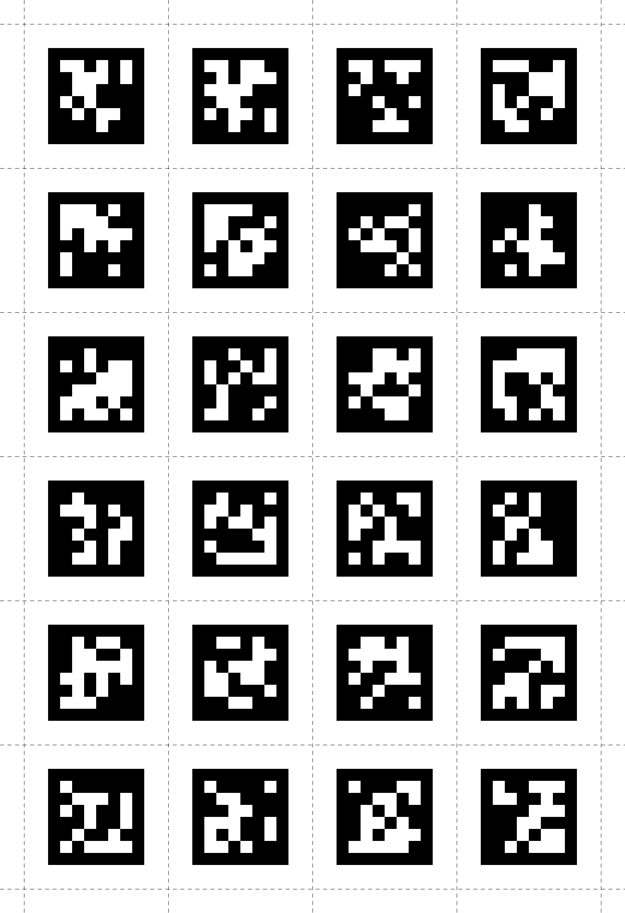
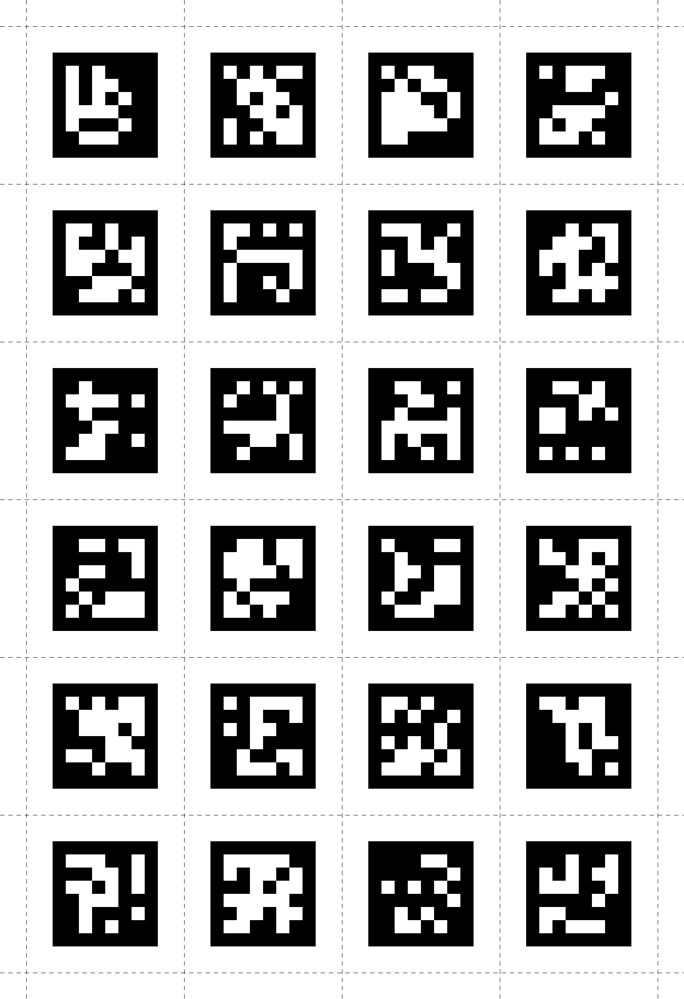

# Create Marker Sheets

Here you can find example scripts for creating your custom marker sheets.

The original Apriltag markers can be found in the submodule folder [apriltag-imgs](./apriltag-imgs).
If you clone this repository, make sure to clone the submodule as well!

The script [`create_full_marker_pdfs.py`](./create_full_marker_pdfs.py) creates a PDF from all markers of a family, with one marker per page.
You can easily use this to generate your own sheets by just printing multiple PDF pages per page.
They also include the IDs, you can see an example for the `tag36h11` family here: [`tag36h11_full.pdf`](./tag36h11_full.pdf?raw=true)

The script [`create_marker_sheet.py`](./create_marker_sheet.py) creates a single page of 24 markers with cutting lines to cut out. Change the global parameters `FAMILY` and `PAGE` to control which set of markers to generate the sheet from.
Here are two examples, ready to download and use:

| `FAMILY="tag36h11"` and `PAGE=0`                                    | `FAMILY="tag36h11"` and `PAGE=1`                                     |
| ------------------------------------------------------------------- | -------------------------------------------------------------------- |
|  |  |

